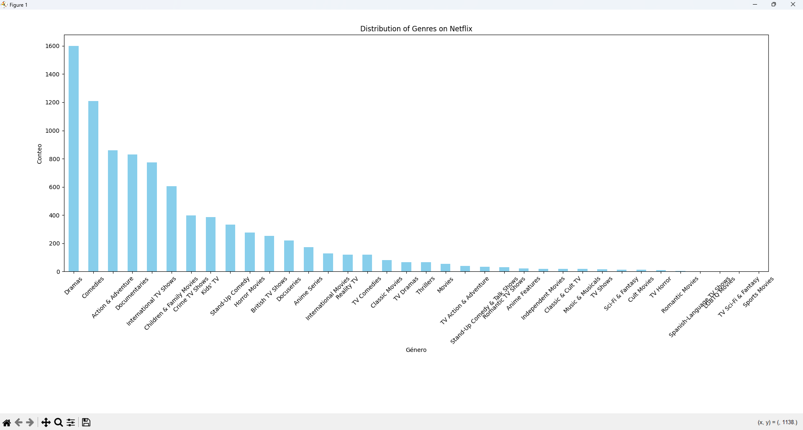

# **Data Analysis Project Portfolio**

## **About Me**  
Hello! I am Emilio Andrés Torres Aravena, an experienced data analyst passionate about working with data and extracting valuable insights for decision-making. In this portfolio, I showcase some of the projects I have worked on, applying tools such as Python, SQLite, Power BI, and more. These projects include data analysis, data visualization, data cleaning and transformation, and data automation. The datasets used are sourced from Kaggle.

---

## **Technical Skills**  
- **Programming Languages**: Python, SQL  
- **Databases**: SQL, SQLite  
- **Visualization Tools**: Power BI, Matplotlib  
- **Python Libraries**: sqlite3, pandas, matplotlib.pyplot  

---

## **Projects**

### **1. Netflix Data Analysis**  
**Description**: This project focuses on cleaning and analyzing a Netflix dataset. Tasks included identifying and handling missing values, removing unnecessary columns, and transforming data to facilitate analysis. Python and the pandas library were used for data manipulation.  

**Skills Demonstrated**:  
- Data cleaning and handling missing values.  
- Removing irrelevant columns and transforming data types.  

**Screenshots**:  
1. **Initial view of the Netflix dataset before modifications**: Displays the initial state of the dataset, including columns and some rows, to understand the starting point.  
   .png)  

2. **Final Visualization of Genre Distribution**: A bar chart showcasing the distribution of genres on Netflix, summarizing the most popular categories for strategic insights.  
     

---

### **2. Cost Analysis of Space Missions**  
**Description**: This project examines the cost and failure rates of space missions over time, identifying trends such as failure rates and average mission costs. It also analyzes the popularity of launches by month. Python, pandas, and matplotlib were used for analysis and visualization.  

**Skills Demonstrated**:  
- Cost and failure trend analysis in space missions.  
- Temporal and categorical data visualization.  
- Interpretation of seasonal patterns in space launches.  

**Screenshots**:  
1. **Failure rates over time**: Displays the annual failure rates of space missions, highlighting patterns and trends.  
   .png)  
2. **Average mission cost over time**: Shows the evolution of average mission costs over the years.  
   .png)  
3. **Popular months for launches**: Bar chart identifying months with the highest number of space launches.  
   .png)  

---

### **3. Amazon Data Visualization**  
**Description**: This project analyzes Amazon product data, focusing on high-price categories, price-rating correlations, and price ranges by subcategory. Visualizations and analyses were created using Python, pandas, seaborn, and Power BI.  

**Skills Demonstrated**:  
- Exploratory data analysis.  
- Data visualization to identify patterns.  

**Screenshots**:  
1. **Data cleaning and preparation code**: Shows the data preparation process for Amazon product analysis.  
   .png)  
2. **Average price by category**: Displays categories with the highest-priced products.  
   .png)  
3. **Price-rating correlation graph**: Highlights the relationship between price and product ratings.  
   .png)  

---

### **4. Sales Analysis with SQLite**  
**Description**: This project involves manipulating and analyzing sales data using SQLite. SQL queries were executed to extract key information on sales, products, and customers. Python was used to automate and visualize results.  

**Skills Demonstrated**:  
- Advanced SQL queries.  
- Python-based automation.  

**Screenshots**:  
1. **Database table creation**: Defines tables like `products`, `customers`, `orders`, and `sales`.  
   .png)  
2. **Key query results**: SQL query showing customers by category and total purchases, ordered by purchase value.  
   .png)  
3. **Detailed sales analysis by category**: Python code for monthly sales visualization by category.  
   .png)  

---

### **5. Human Resources Analysis**  
**Description**: This project analyzes a company's human resources data, focusing on employee distribution by characteristics such as region, education level, and work schedule type. Power BI was used for interactive and clear data visualization.  

**Skills Demonstrated**:  
- Human resources analysis using interactive charts.  
- Data visualization for decision-making in personnel management.  

**Screenshots**:  
1. **General chart showing employee distribution by region**: Visualizes employee distribution across regions without any filters applied.  
   .png)  
2. **Breakdown of employees by work schedule**: Represents employees' distribution across on-site, remote, or hybrid schedules.  
   .png)  
3. **Distribution of employees by education level**: Shows employees' educational levels (undergraduate, graduate, postgraduate), filtered by the HR department.  
   .png)  

